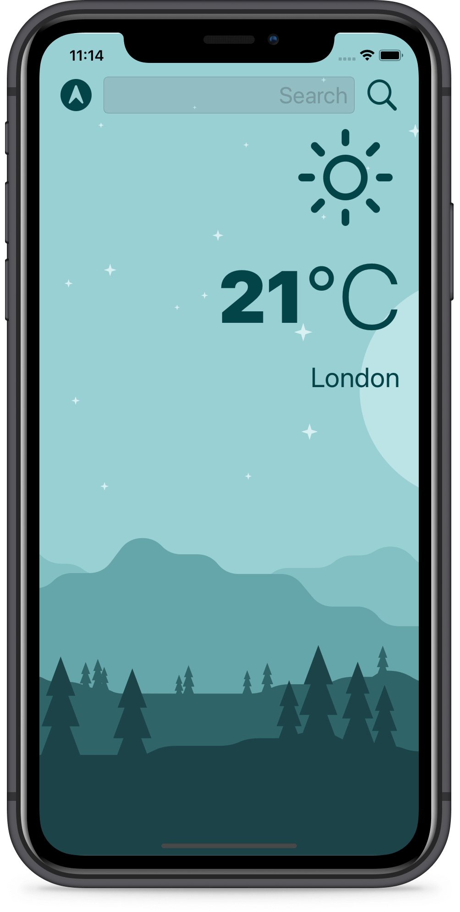

# Clima
A beautiful, dark-mode enabled weather app. You'll be able to check the weather for the current location based on the GPS data from the iPhone as well as by searching for a city manually. The project has been written solely in Swift Language.

## Through this project, I've learned:
-	How to create a dark-mode enabled app.
-   How to use vector images as image assets.
-   How to use the UITextField to get user input.
-   About the delegate pattern.
-   Swift protocols and extensions.
-   Swift guard keyword.
-   Swift computed properties.
-   Swift closures and completion handlers.
-   How to use URLSession to network and make HTTP requests.
-   Parse JSON with the native Encodable and Decodable protocols.
-   How to use Grand Central Dispatch to fetch the main thread.
-   How to use Core Location to get the current location from the phone GPS.

Screenshot of the app:

