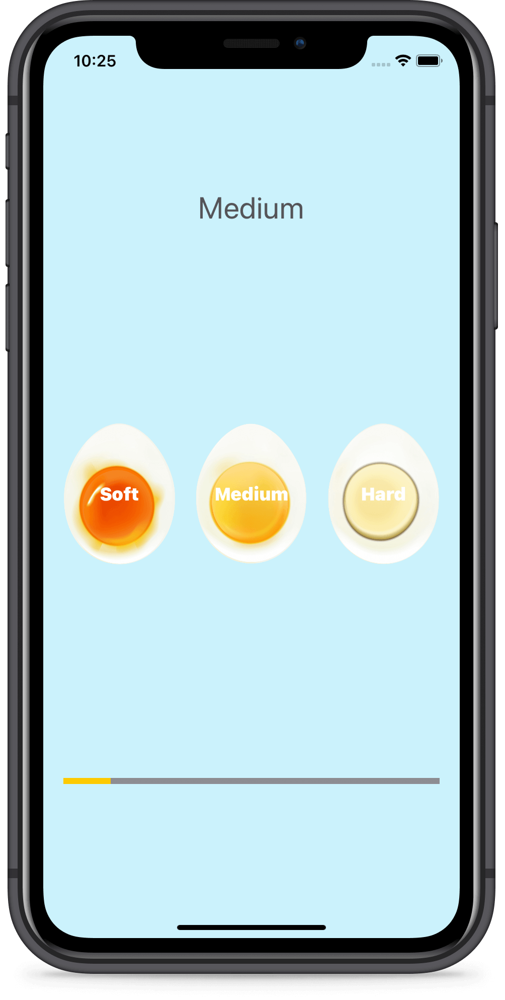

# Xylophone
A beautiful egg timer app to boil your eggs to perfection depending on how you prefer your eggs. The project has been written solely in Swift Language.

## Through this project, I've learned:
-	Swift Collection types - Dictionaries
-   The Swift Timer API
-   Conditional statements - IF/ELSE
-   Conditional statements - Switch
-   Functions with outputs
-   How to use the ProgressView

Screenshot of the app:

