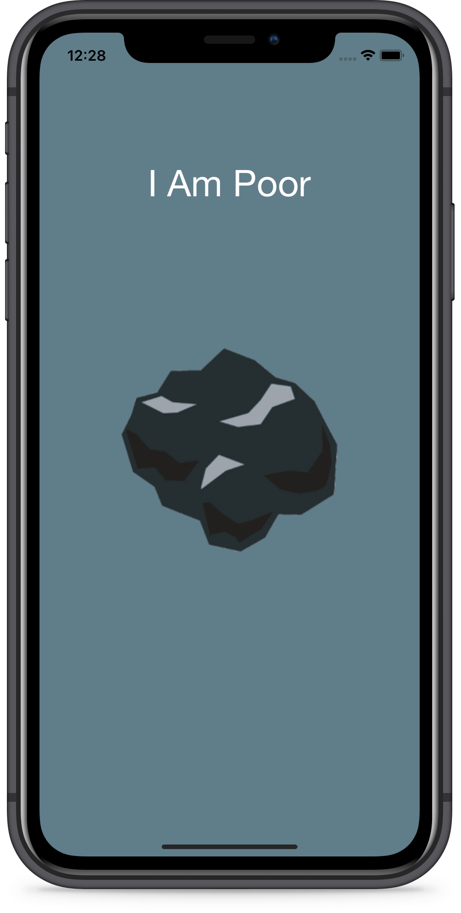

# I Am Poor
An app that simply displays an image at the center of the screen. The project has been written solely in Swift Language.

## Through this project, I've learned how to:
-	set up a new Xcode project.
-	use the Interface Builder to design and create the appearance of your app.
-	find your way around Xcode.
-   size and arrange various UI elements.
-   add custom image assets to Xcode projects.
-   create app icons and size them for all resolutions. 
-   run apps on the iOS Simulator as well as sideload to a physical device.

Screenshot of the app:

