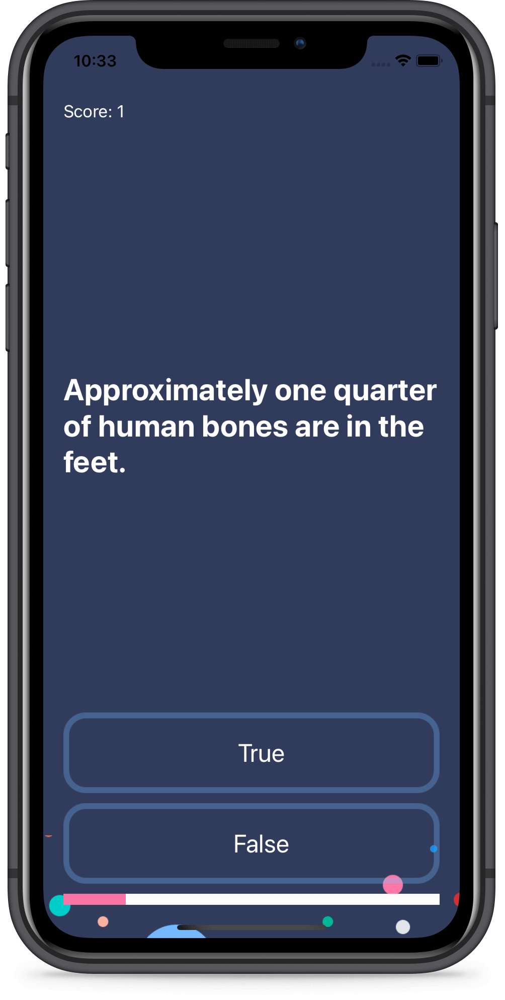

# Quizzler
A quiz app that tests your general knowledge. The project has been written solely in Swift Language.

## Through this project, I've learned:
-	What is a design pattern and how is it used in programming.
-   How to use the Model-View-Controller or MVC pattern for app development.
-   Swift structures and functions with outputs.
-   Learn about Object Oriented Programming.
-   Learn to use UIAlertControllers to display popups to the user.
-   How to refactor code and stay organised.
-   Learn about object initialisation.
-   How to programmatically change UI elements such as Labels and Views.

Screenshot of the app:

