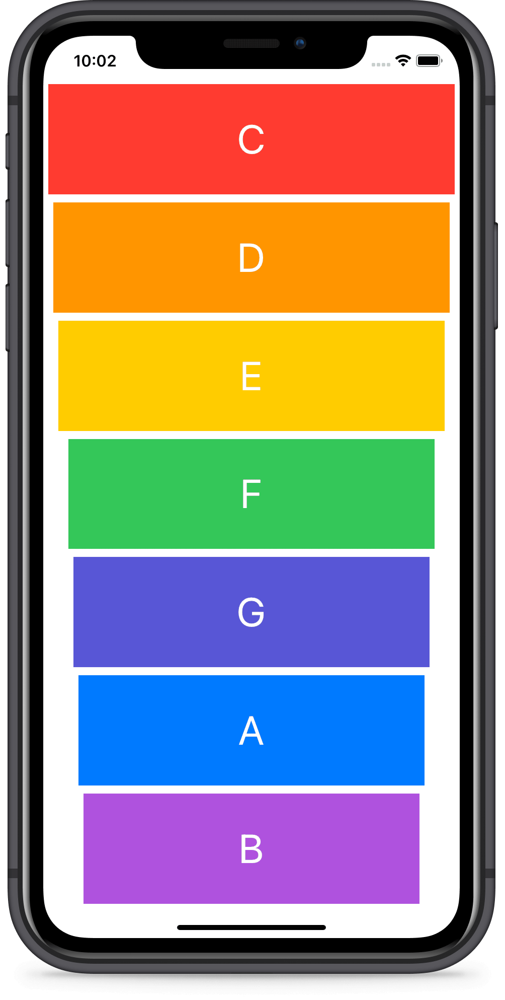

# Xylophone
An app that plays Xylophone sounds. The project has been written solely in Swift Language.

## Through this project, I've learned:
-	How to play sound using AVFoundation and AVAudioPlayer.
-   Understand Apple documentation and how to use StackOverflow.
-   Functions and methods in Swift.
-   Data types.
-   Swift loops.
-   Variable scope.
-   The ViewController lifecycle.
-   Error handling in Swift.
-   Code refactoring.
-   Basic debugging.

Screenshot of the app:

